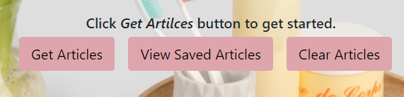
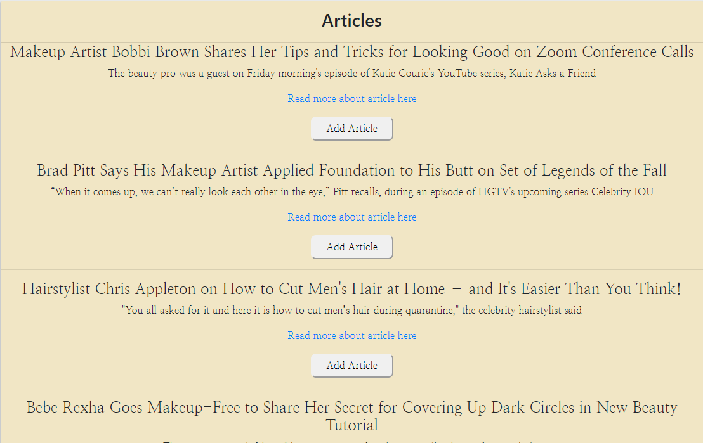
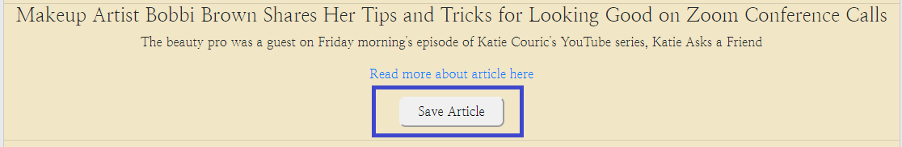
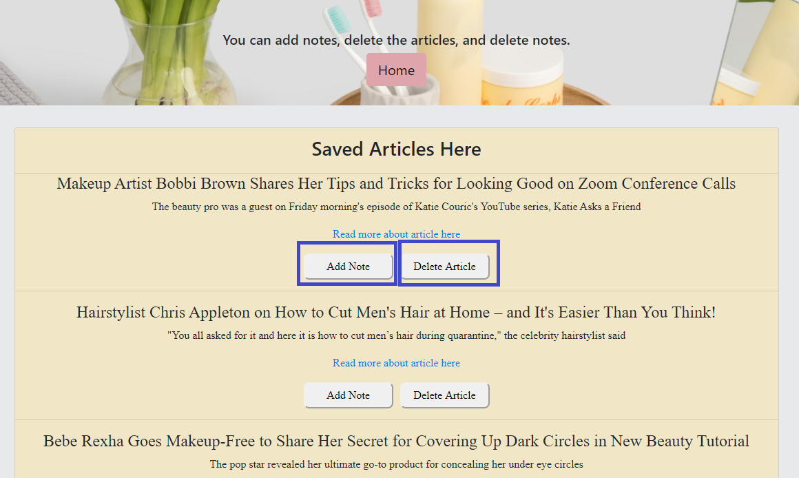
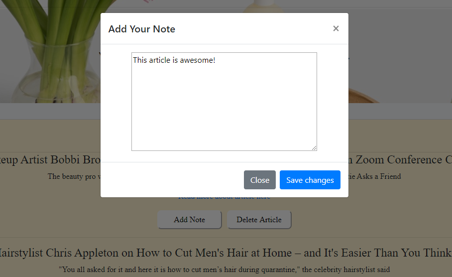
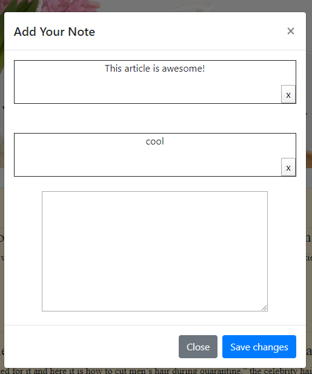

# Scrape-news-time
Staying informed of all things health and beauty experts and hollywood stars from People.com via webscraping.

Click Get Articles to start 

We now have articles from People.com to look over. There is title, short summary, and link to read more about the article.  
 

Article can be saved.
 

When you click on "View Saved Articles", you will see this. You will have an option to add a note and delete the article. 
 

Add in your note. 
 

You can see other users notes. 
 

## Technologies Used:
* HTML
* CSS
* JQuery
* Bootstrap
* Node.js
* Express
* Mongoose 
* MongoDB
* Axios
* Cheerio

